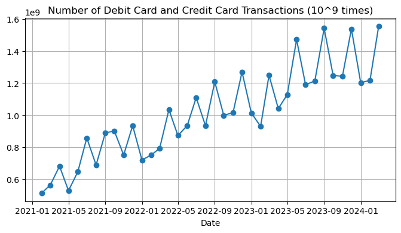
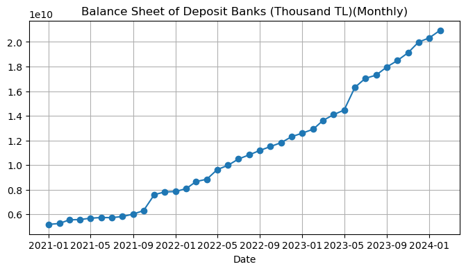
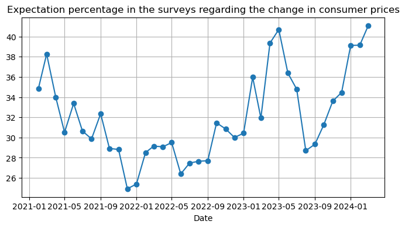
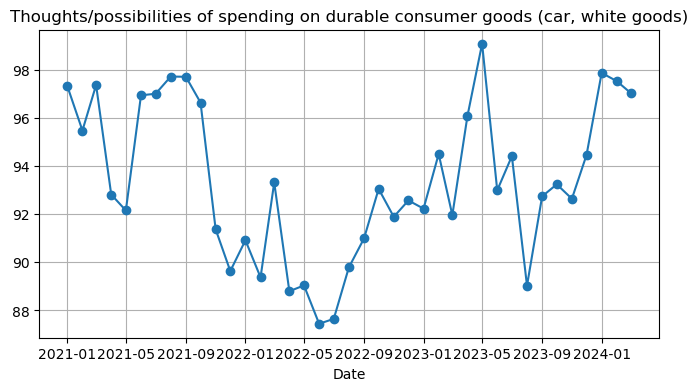
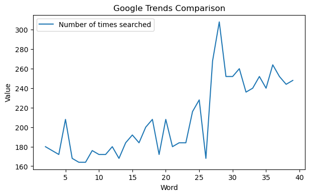
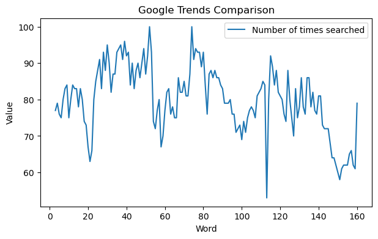
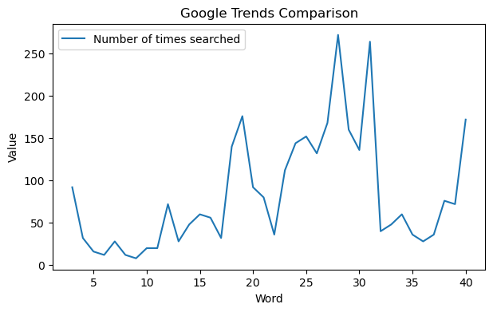
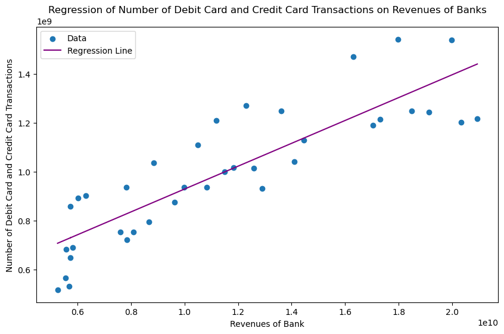
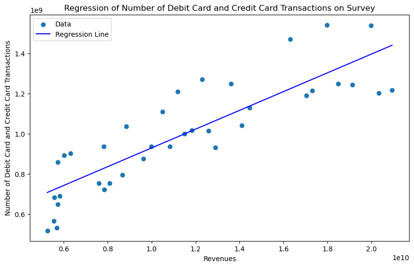
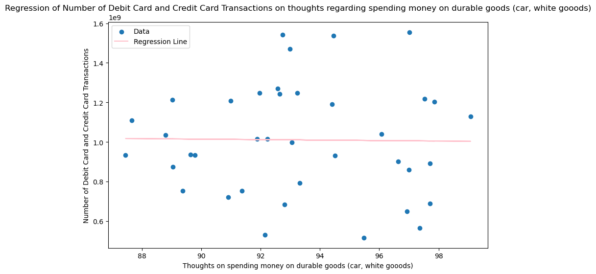

INTRODUCTION
In this study, "the relationship between credit card usage and three pivotal categories—consumer price expectations, intention to spend on durable goods, and actual spending on durable goods—" is examined. Official websites like Google Trends and the Central Bank of the Republic of Turkey (CBRT) are the source of the data. 

There are two parts that the investigation takes. First, we examine the relationship between the previously specified categories and the data about some related keywords from Google Trends. Then, using a variety of methods, time series regression models are created for every category. We want to reveal a model that explains the credit card usage through taking into account elements like residual analysis and the significance of coefficients.

Python Script:
First we imported required libraries. 


```python
import pandas as pd
import numpy as np
import statsmodels.api as sm

def calculate_correlation(file1_name, file2_name):
    try:
        df1 = pd.read_excel(file1_name)
        df2 = pd.read_excel(file2_name)
        
        column2_file1 = df1.iloc[:, 1]
        column2_file2 = df2.iloc[:, 1]
        
        correlation = column2_file1.corr(column2_file2)
        
        return correlation
    except Exception as e:
        print(f"Error processing files: {str(e)}")
        return None
```

Firstly, line graph of the card usage in Turkiye is plotted. There is an obvious positive trend:


```python
card = pd.read_excel("card.xlsx", parse_dates=[0])  

plt.figure(figsize=(8, 4))
plt.plot(card.iloc[:, 0], card.iloc[:, 1], marker='o', linestyle='-')
plt.xlabel('Date')  
plt.title('Number of Debit Card and Credit Card Transactions (10^9 times)')
plt.grid(True)
plt.show()
```


    

    


The first category that will be analysed is "Balance Sheet of Deposit Banks (Thousand TL)(Monthly)"


```python
bank = pd.read_excel("bank_revenue.xlsx", parse_dates=[0])  

plt.figure(figsize=(8, 4))
plt.plot(bank.iloc[:, 0], bank.iloc[:, 1], marker='o', linestyle='-')
plt.xlabel('Date')  
plt.title('Balance Sheet of Deposit Banks (Thousand TL)(Monthly)')
plt.grid(True)
plt.show()
```


    

    


The second category that will be analysed is "Expectation percentage in the surveys regarding the change in consumer prices"


```python
survey = pd.read_excel("survey.xlsx", parse_dates=[0])  

plt.figure(figsize=(8, 4))
plt.plot(survey.iloc[:, 0], survey.iloc[:, 1], marker='o', linestyle='-')
plt.xlabel('Date')  
plt.title('Expectation percentage in the surveys regarding the change in consumer prices')
plt.grid(True)
plt.show()
```


    

    


The third category that will be analysed is "Thought/possibility of spending on durable consumer goods (car, white goods)"


```python
spend_possibility = pd.read_excel("EVDS-4.xlsx", parse_dates=[0])  

plt.figure(figsize=(8, 4))
plt.plot(spend_possibility.iloc[:, 0], spend_possibility.iloc[:, 1], marker='o', linestyle='-')
plt.xlabel('Date')  
plt.title('Thoughts/possibilities of spending on durable consumer goods (car, white goods)')
plt.grid(True)
plt.show()
```


    

    


```python
card = "card.xlsx"
survey = "survey.xlsx"
bank = "bank_revenue.xlsx"
spend_possibility = "EVDS-4.xlsx"

correlation1 = calculate_correlation(bank, survey)
correlation2 = calculate_correlation(bank, spend_possibility)
correlation3 = calculate_correlation(survey, spend_possibility)
print(correlation1)
print(correlation2)
print(correlation3)
```

    0.45914644339328337
    6.189729108783601e-06
    0.5449238286447758


Here, all the correlations are relatively low. Especially, the second correlation is almost zero. Finding lower correlations (below 0.5) has been tried, however due to the restriction about data sources (only Central Bank) another dataframes could not be found.

PART1 
GOOGLE TRENDS

Turkish words "Banka", "Zam" and "Sahibinden" (Online marketplace for cars, flats etc.) were chosen.


```python
word_banka = "banka_word.xlsx"
word_zam = "word_zam.xlsx"
word_sahibinden = "word_sahibinden.xlsx"
```


```python
correlation4 = calculate_correlation(word_banka, bank)
correlation5 = calculate_correlation(word_zam, survey)
correlation6 = calculate_correlation(word_sahibinden, spend_possibility)
print(correlation4)
print(correlation5)
print(correlation6)
```

    0.7987906040746326
    0.2597863789245446
    0.3797381670130357


The first correlation is high. It can be said that, when people search for banks they tned to be active customers. That might cause the revenues of banks to increase

The second and third one are interestingly low. Both of the datas are from surveys that were conducted on customers. Realiablity of the surveys might be questioned.

Now, Google Trends data will be analyzed visually:


```python
import matplotlib.pyplot as plt

def plot_time_series(file1_name):
    try:
        df1 = pd.read_excel(file1_name, header=None)
        time_series1 = df1.iloc[:, 1]
        
        plt.figure(figsize=(7, 4))
        plt.plot(time_series1, label='Number of times searched')
        plt.xlabel('Word')
        plt.ylabel('Value')
        plt.title('Google Trends Comparison')
        plt.legend()

        plt.show()
    except Exception as e:
        print(f"Error plotting time series data: {str(e)}")

plot_time_series(word_banka) #bank
plot_time_series(word_sahibinden) # spend_possibility
plot_time_series(word_zam) # survey
```


    

    


    

    


    

    


PART 2
REGRESSION MODELS


```python
card_usage = pd.read_excel('card.xlsx', parse_dates=[0], index_col=0)
bank_revenue = pd.read_excel('bank_revenue.xlsx', parse_dates=[0], index_col=0)


merged_data = pd.merge(card_usage, bank_revenue, how='inner', left_index=True, right_index=True)

X = merged_data.iloc[:, 1]  # Independent variable 
y = merged_data.iloc[:, 0] 
X = sm.add_constant(X)

model = sm.OLS(y, X).fit()

print(model.summary())


plt.figure(figsize=(10, 6))
plt.scatter(X.iloc[:, 1], y, label='Data')
plt.plot(X.iloc[:, 1], model.predict(X), color='purple', label='Regression Line')
plt.xlabel('Revenues of Bank')
plt.ylabel('Number of Debit Card and Credit Card Transactions')
plt.title('Regression of Number of Debit Card and Credit Card Transactions on Revenues of Banks')
plt.legend()
plt.show()

```

                                OLS Regression Results                            
    ==============================================================================
    Dep. Variable:              609061890   R-squared:                       0.739
    Model:                            OLS   Adj. R-squared:                  0.732
    Method:                 Least Squares   F-statistic:                     99.22
    Date:                Fri, 05 Apr 2024   Prob (F-statistic):           9.39e-12
    Time:                        20:59:54   Log-Likelihood:                -745.15
    No. Observations:                  37   AIC:                             1494.
    Df Residuals:                      35   BIC:                             1498.
    Df Model:                           1                                         
    Covariance Type:            nonrobust                                         
    ==============================================================================
                     coef    std err          t      P>|t|      [0.025      0.975]
    ------------------------------------------------------------------------------
    const       4.613e+08   5.83e+07      7.909      0.000    3.43e+08     5.8e+08
    Unnamed: 1     0.0467      0.005      9.961      0.000       0.037       0.056
    ==============================================================================
    Omnibus:                        4.015   Durbin-Watson:                   2.035
    Prob(Omnibus):                  0.134   Jarque-Bera (JB):                2.181
    Skew:                           0.337   Prob(JB):                        0.336
    Kurtosis:                       2.020   Cond. No.                     3.18e+10
    ==============================================================================
    
    Notes:
    [1] Standard Errors assume that the covariance matrix of the errors is correctly specified.
    [2] The condition number is large, 3.18e+10. This might indicate that there are
    strong multicollinearity or other numerical problems.


    

    


The data of the second category will be analyzed:


```python

card_usage = pd.read_excel('card.xlsx', parse_dates=[0], index_col=0)
survey = pd.read_excel('bank_revenue.xlsx', parse_dates=[0], index_col=0)

merged_data = pd.merge(card_usage, survey, how='inner', left_index=True, right_index=True)

X = merged_data.iloc[:, 1]  # Independent variable 
y = merged_data.iloc[:, 0] 

X = sm.add_constant(X)
model = sm.OLS(y, X).fit()

print(model.summary())

plt.figure(figsize=(10, 6))
plt.scatter(X.iloc[:, 1], y, label='Data')
plt.plot(X.iloc[:, 1], model.predict(X), color='Blue', label='Regression Line')
plt.xlabel('Revenues')
plt.ylabel('Number of Debit Card and Credit Card Transactions')
plt.title('Regression of Number of Debit Card and Credit Card Transactions on Survey')
plt.legend()
plt.show()

```

                                OLS Regression Results                            
    ==============================================================================
    Dep. Variable:              609061890   R-squared:                       0.739
    Model:                            OLS   Adj. R-squared:                  0.732
    Method:                 Least Squares   F-statistic:                     99.22
    Date:                Fri, 05 Apr 2024   Prob (F-statistic):           9.39e-12
    Time:                        20:59:54   Log-Likelihood:                -745.15
    No. Observations:                  37   AIC:                             1494.
    Df Residuals:                      35   BIC:                             1498.
    Df Model:                           1                                         
    Covariance Type:            nonrobust                                         
    ==============================================================================
                     coef    std err          t      P>|t|      [0.025      0.975]
    ------------------------------------------------------------------------------
    const       4.613e+08   5.83e+07      7.909      0.000    3.43e+08     5.8e+08
    Unnamed: 1     0.0467      0.005      9.961      0.000       0.037       0.056
    ==============================================================================
    Omnibus:                        4.015   Durbin-Watson:                   2.035
    Prob(Omnibus):                  0.134   Jarque-Bera (JB):                2.181
    Skew:                           0.337   Prob(JB):                        0.336
    Kurtosis:                       2.020   Cond. No.                     3.18e+10
    ==============================================================================
    
    Notes:
    [1] Standard Errors assume that the covariance matrix of the errors is correctly specified.
    [2] The condition number is large, 3.18e+10. This might indicate that there are
    strong multicollinearity or other numerical problems.


    

    


The data of the third category will be analyzed:


```python
card_usage = pd.read_excel('card.xlsx', parse_dates=[0], index_col=0)
spend_possibility = pd.read_excel('EVDS-4.xlsx', parse_dates=[0], index_col=0)

merged_data = pd.merge(card_usage, spend_possibility, how='inner', left_index=True, right_index=True)

X = merged_data.iloc[:, 1]  # Independent variable 
y = merged_data.iloc[:, 0] 

X = sm.add_constant(X)
model = sm.OLS(y, X).fit()

print(model.summary())

plt.figure(figsize=(10, 6))
plt.scatter(X.iloc[:, 1], y, label='Data')
plt.plot(X.iloc[:, 1], model.predict(X), color='Pink', label='Regression Line')
plt.xlabel('Thoughts on spending money on durable goods (car, white gooods)')
plt.ylabel('Number of Debit Card and Credit Card Transactions')
plt.title('Regression of Number of Debit Card and Credit Card Transactions on thoughts regarding spending money on durable goods (car, white gooods)')
plt.legend()
plt.show()

```

                                OLS Regression Results                            
    ==============================================================================
    Dep. Variable:              609061890   R-squared:                       0.000
    Model:                            OLS   Adj. R-squared:                 -0.028
    Method:                 Least Squares   F-statistic:                  0.006855
    Date:                Fri, 05 Apr 2024   Prob (F-statistic):              0.934
    Time:                        20:59:54   Log-Likelihood:                -792.43
    No. Observations:                  38   AIC:                             1589.
    Df Residuals:                      36   BIC:                             1592.
    Df Model:                           1                                         
    Covariance Type:            nonrobust                                         
    ==============================================================================
                     coef    std err          t      P>|t|      [0.025      0.975]
    ------------------------------------------------------------------------------
    const       1.123e+09   1.35e+09      0.831      0.412   -1.62e+09    3.86e+09
    Unnamed: 1 -1.199e+06   1.45e+07     -0.083      0.934   -3.06e+07    2.82e+07
    ==============================================================================
    Omnibus:                        0.796   Durbin-Watson:                   0.526
    Prob(Omnibus):                  0.672   Jarque-Bera (JB):                0.829
    Skew:                           0.183   Prob(JB):                        0.661
    Kurtosis:                       2.376   Cond. No.                     2.75e+03
    ==============================================================================
    
    Notes:
    [1] Standard Errors assume that the covariance matrix of the errors is correctly specified.
    [2] The condition number is large, 2.75e+03. This might indicate that there are
    strong multicollinearity or other numerical problems.


    

    


IMPROVING MODEL


```python
"""
from statsmodels.tsa.seasonal import seasonal_decompose
from statsmodels.tsa.arima.model import ARIMA
from sklearn.linear_model import LinearRegression
from sklearn.metrics import mean_squared_error

data = pd.read_excel("bank_revenue.xlsx")
# Preprocess data as needed
card_usage = pd.read_excel('card.xlsx', parse_dates=[0], index_col=0)
# Decompose the time series to extract trend and seasonality
result = seasonal_decompose(data['card_usage'], model='additive', period=12)  # Adjust period as per seasonality
trend = result.trend
seasonal = result.seasonal

# Add trend and seasonality features to the dataset
data['trend'] = trend
data['seasonal'] = seasonal

# Split the data into features (X) and target variable (y)
X = data[['feature1', 'feature2', 'trend', 'seasonal']]
y = data['card_usage']

# Train a regression model
model = LinearRegression()
model.fit(X, y)

# Make predictions
y_pred = model.predict(X)

# Evaluate model performance
mse = mean_squared_error(y, y_pred)
print("Mean Squared Error:", mse)
"""


from statsmodels.tsa.seasonal import seasonal_decompose
import pandas as pd

# Read the two Excel files
data1 = pd.read_excel("bank_revenue.xlsx", parse_dates=[0], index_col=0)
data2 = pd.read_excel("card.xlsx", parse_dates=[0], index_col=0)

# Decompose the time series data from the first Excel file
result1 = seasonal_decompose(data1, model='additive', period=12)  # Adjust period as per seasonality
trend1 = result1.trend
seasonal1 = result1.seasonal

# Decompose the time series data from the second Excel file
result2 = seasonal_decompose(data2, model='additive', period=12)  # Adjust period as per seasonality
trend2 = result2.trend
seasonal2 = result2.seasonal


# Add trend and seasonality features to the dataset
data['trend'] = trend
data['seasonal'] = seasonal

# Split the data into features (X) and target variable (y)
X = data[['feature1', 'feature2', 'trend', 'seasonal']]
y = data2

# Train a regression model
model = LinearRegression()
model.fit(X, y)

# Make predictions
y_pred = model.predict(X)

# Evaluate model performance
mse = mean_squared_error(y, y_pred)
print("Mean Squared Error:", mse)
```


    ---------------------------------------------------------------------------

    NameError                                 Traceback (most recent call last)

    Cell In[284], line 56
         51 seasonal2 = result2.seasonal
         55 # Add trend and seasonality features to the dataset
    ---> 56 data['trend'] = trend
         57 data['seasonal'] = seasonal
         59 # Split the data into features (X) and target variable (y)


    NameError: name 'trend' is not defined


Conclusion

